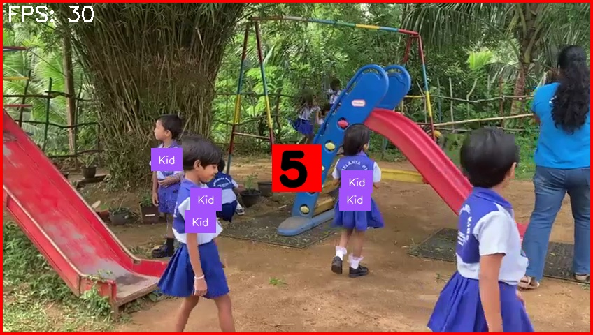

# Kids Care AI - Range Detection

Kids Care AI IOT Device - RaspberryPi and Picamera range detection.



## SSH Login to Raspberry PI

```cmd
ssh admin@raspberrypi.local
```

password: `admin`

## Configurations

`paths.py`

```python
VIDEO_PATH = r"samples/v2.mp4"
MODEL_PATH = r"YOLO/94.1 63.3/model.pt"
```

`firebase.py

```python
# Firebase Configuration
GOOGLE_APPLICATION_CREDENTIALS = 'kidzcare-97f3c-firebase-adminsdk-fpml6-3904295b4d.json'
FIREBASE_STORAGE_BUCKET = 'kidzcare-97f3c.appspot.com'
FIREBASE_DATABASE_NAME = '/kiddycare'
FIREBASE_DATABASE_URL = 'https://kidzcare-97f3c-default-rtdb.firebaseio.com'

users_ref = firebase_ref.child('range_detection')
````

--- 

## Run

 ```bash
 python start.py
 ```
